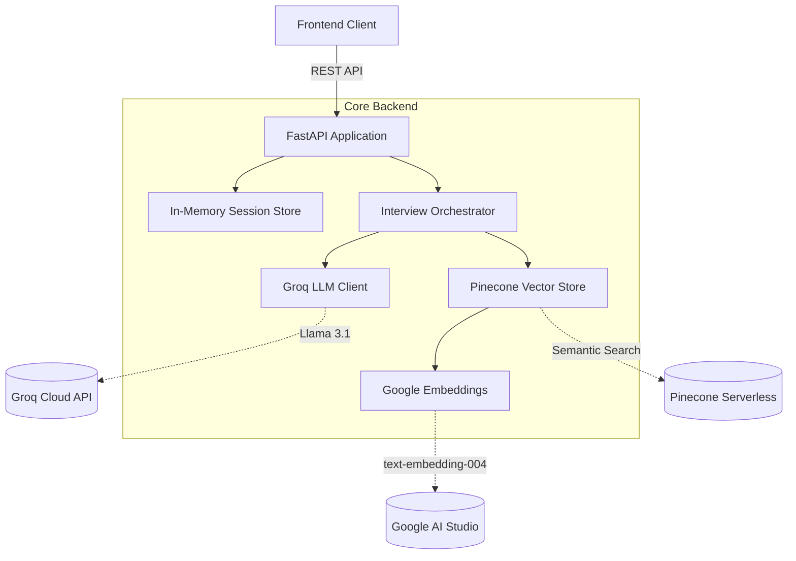

<div align="center">
  
  <br>
  <h1>🤖 AI Interview Agent</h1>
  <p><b>An Adaptive, Intelligent, and Thorough Technical Interviewer</b></p>
  <p><i>Powered by Groq, Google Generative AI, and Pinecone Serverless</i></p>

  ---
  
  [](https://www.python.org/)
  [](https://fastapi.tiangolo.com/)
  [](https://groq.com/)
  [](https://www.pinecone.io/)
  [](https://www.docker.com/)

</div>

---

## 🌟 Overview

The **AI Interview Agent** is a production-ready, fully asynchronous backend system designed to conduct deep, dynamic technical interviews. Simulating a Senior AI Engineer at a top tech company, this system doesn't just ask static questions—it adapts its difficulty in real-time, probes candidate weaknesses, and evaluates both theoretical knowledge and practical system design.

### 🎯 Key Features

* **Adaptive Difficulty Engine:** Dynamically adjusts the complexity of questions based on a real-time running average of the candidate's scores.
* **Intelligent Topic Selection:** Prioritizes probing identified weaknesses, then candidates' self-reported weaknesses, and finally uncovers fresh curriculum topics.
* **Semantic Curriculum Retrieval:** Uses **Google Generative AI Embeddings** and **Pinecone Serverless** to semantically search and inject highly relevant curriculum context into the LLM prompt.
* **Deterministic LLM Output:** Leverages structured output parsing with robust fallback mechanisms to guarantee precise JSON responses from **Groq (Llama 3.1 70B)**.
* **In-Memory State Management:** Lightning-fast, lock-free session state handling ensuring smooth, stateful conversations.
* **Comprehensive Evaluation:** Generates a final, detailed post-interview report highlighting strengths, weaknesses, missed concepts, and recommended learning paths.

---

## 🏗️ Architecture



---

## 🚀 Getting Started

### Prerequisites

* Python 3.12+
* API Keys for:
  * [Groq](https://console.groq.com/)
  * [Google AI Studio](https://aistudio.google.com/)
  * [Pinecone](https://www.pinecone.io/)

### Local Setup

1. **Clone the repository and enter the backend directory:**
   ```bash
   cd backend
   ```

2. **Set up environment variables:**
   ```bash
   cp .env.example .env
   ```
   *Edit `.env` and insert your API keys.*

3. **Install dependencies:**
   ```bash
   pip install -r requirements.txt
   ```

4. **Run the server:**
   ```bash
   uvicorn app.main:app --reload
   ```

5. **View API Docs:**
   Navigate to `http://localhost:8000/docs` for the interactive Swagger UI.

---

## 🐳 Docker Deployment

To run the entire system in a production-ready Docker container:

```bash
cd backend
docker-compose up --build -d
```

The API will be available at `http://localhost:8000`.

---

## 🧪 Testing

The project maintains a rigorous, fully-mocked asynchronous test suite.

```bash
cd backend
pytest tests/ -v
```

> **Note:** Tests do not require real API keys, as external API calls (Groq, Google, Pinecone) are mocked at the service layer to ensure reliable, deterministic, and blazing-fast test execution.

---

## 📂 Project Structure

```text
backend/
├── app/
│   ├── api/          # FastAPI Route handlers
│   ├── config/       # Environment & Settings management
│   ├── core/         # Dependency injection & Logging
│   ├── embeddings/   # Google GenAI wrapper
│   ├── interview/    # Core business logic orchestrators
│   ├── memory/       # Session & State management
│   ├── models/       # Pydantic schemas
│   ├── prompts/      # LLM Templates
│   ├── retrieval/    # Pinecone vector operations
│   └── utils/        # Data loading and text chunking
├── data/             # Curriculums, Candidates, Tech Specs (JSON)
├── tests/            # Pytest test suite
├── Dockerfile        # Production Docker configuration
└── requirements.txt  # Python dependencies
```

---

<div align="center">
  <i>Built with passion for next-generation technical assessments.</i>
</div>
